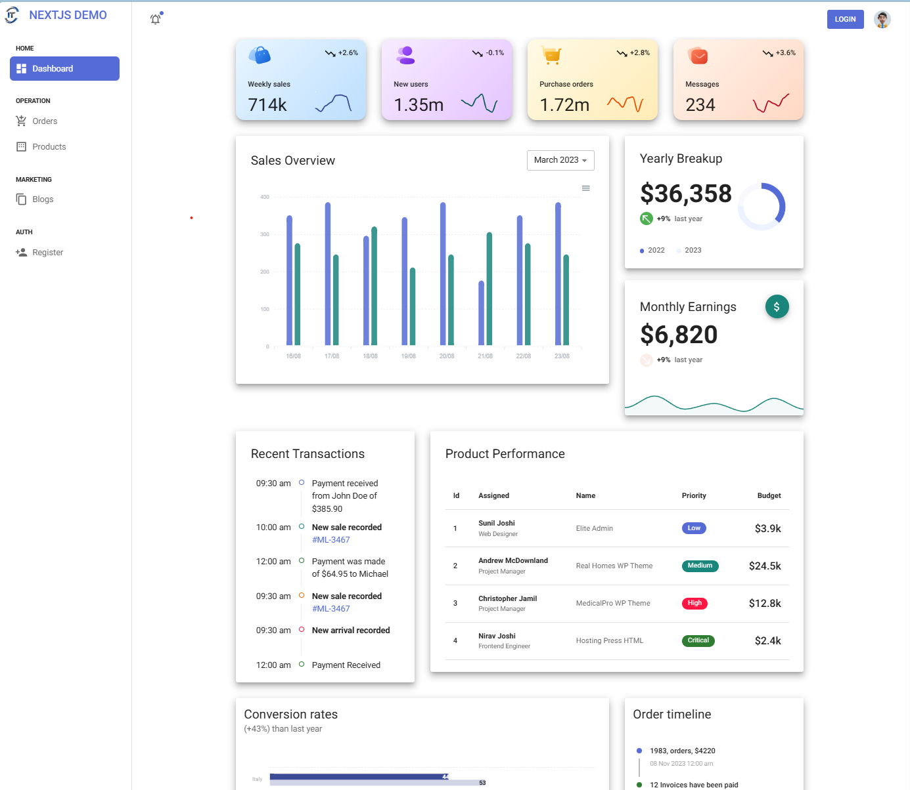
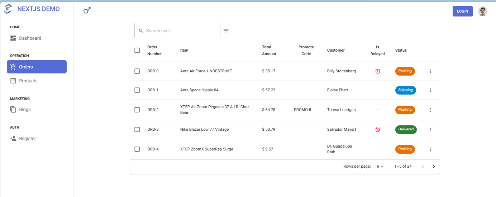
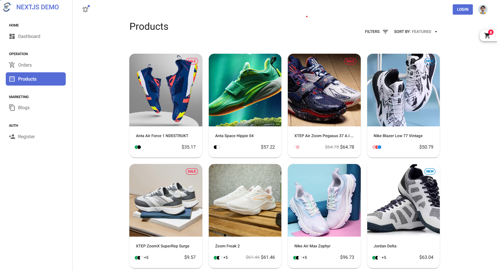
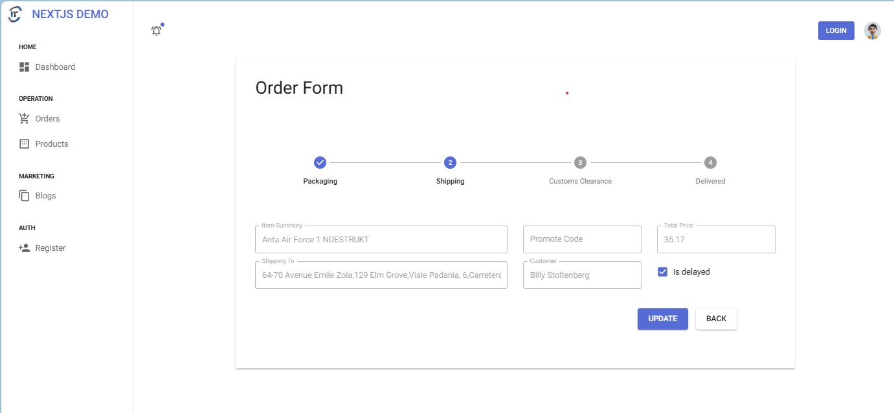

## NextJS Mui Demo


This is a [Next.js](https://nextjs.org) integrated with [Mui](https://mui.com/).

### Prerequisites
- Node 20+
- VS Code


### Getting Started

* Run the development server:

```bash
npm run dev
```

Open [http://localhost:3000](http://localhost:3000) with your browser to see the result.


* Build and test production version

```bash
# it will take a while 
npm run build 

# launch prodcution version
npm start
```

Open [http://localhost:3000](http://localhost:3000) with your browser to see the result. Comparing to dev version, the production version is much faster.


### Live Demo

[Live Demo](https://nextjs-mui-demo.harryho.org) is available here. 








